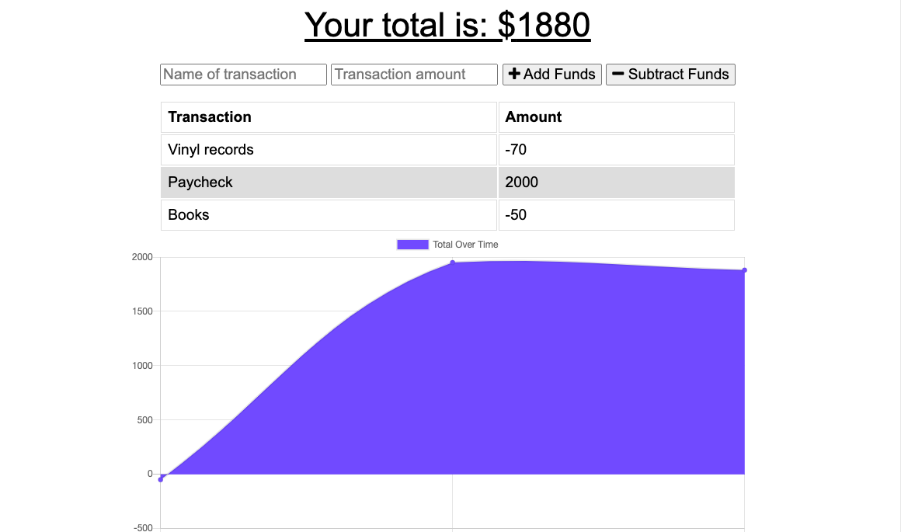

# Budget Tracker

## Purpose
A budget tracker buddy to keep you on track of your finances...forever. Use your budget buddy on the go, even without access to a network. Using IndexedDB and Service Workers makes this all possible! 

## Built With
* JavaScript
* Node
* Express.js
* Mongoose
* MongoDB 
* Heroku

## Website
https://budget-buddyforever.herokuapp.com/

## Usage
npm install 
Run: npm start in the terminal to start the server

## Contribution
Made by Lily Hissong 🌿

Screenshot displaying Budget Tracker:
